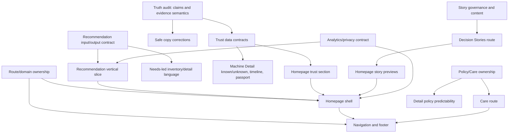

# MBMC Decision Architecture Gap Analysis

Analysis date: 2026-07-22  
Baseline: current `muabanmacbookcu-web` repository and `docs/repository-audit.md`  
Scope: analysis and implementation sequencing only; no code, UI, or refactoring is included

## Executive Summary

The current repository is a trustworthy inventory-and-machine-dossier foundation, not yet the public interface of MBMC Decision Studio. It does one of MBMC's four core jobs relatively well: helping a visitor understand a specific machine. It provides public inventory, real-machine imagery, configuration, price, reviewed condition copy, a sparse passport, editorial fit guidance, and calm contact paths. Its data architecture is stronger than its current information architecture: the public projection layer already creates a controlled boundary between private operational data and versioned public DTOs.

The largest gap is not visual. The product source of truth starts with the person and moves through `Confusion → Orientation → Understanding → Trust → Confidence → Decision → Care`; the live site starts with available machines and moves through `Catalog → Detail → Contact`. `/` permanently redirects to inventory. Recommendation, Decision Stories, and Care do not exist. Navigation and footer do not describe a coherent Decision Studio. Machine Detail contains pieces of the desired dossier but orders contact and machine facts ahead of a complete suitability/trade-off/known-unknown explanation.

The second major gap is evidence readiness. The Trust System requires inspection, Passport, Timeline, Known/Unknown, policy predictability, and a separation between fact and human judgement. Current contracts contain placeholders for many of these, but the repository assembles inspection as unavailable, warranty/source verification/repair status as unknown, timeline/facts as empty, and policy applicability as unused. Inventory nevertheless claims that machines have been inspected. This truthfulness mismatch is the critical blocker for trust-heavy redesign work.

The safest implementation strategy is incremental:

1. Establish truth, ownership, route names, and measurement contracts before changing page hierarchy.
2. Correct unsupported claims and navigation defects in isolated low-risk commits.
3. Build a static, content-first homepage shell using existing public summaries without changing the machine contract.
4. Define Recommendation and Trust contracts before building their full experiences.
5. Improve Machine Detail only as verified evidence becomes available.
6. Add Decision Stories and Care as independent vertical slices with explicit content provenance.

This order minimizes rewrites because it preserves existing routes, the V1 public projection, inventory behavior, and machine components. It also keeps high-conflict global files—`layout.tsx`, `SiteHeader.tsx`, `SiteFooter.tsx`, and `globals.css`—out of parallel feature work until their contracts are settled.

### Portfolio assessment

| Surface | Alignment today | Main gap | Complexity | Refactoring risk | User impact |
|---|---|---|---|---|---|
| Homepage | Very low | Missing orientation and dual entry into Decision Studio | L | Medium | High |
| Recommendation | None | Missing decision model, flow, output contract, and route | XL | High | High |
| Inventory | Medium–high | Structured catalog exists, but not needs-led and contains an unsupported inspection claim | M | Medium | High |
| Machine Detail | Medium | Evidence shell exists; trade-offs, unknowns, timeline, policies, and order are incomplete | L–XL depending on data | High | High |
| Decision Stories | None | Missing story model, evidence/privacy process, route, and content | L | Medium | Medium–High |
| Care | None in app | Missing post-decision route, content ownership, and policy integration | M | Medium | Medium–High |
| Navigation | Low–medium | Does not represent the target sitemap; contains a dead fragment and mixed ownership | S–M | Medium | High |
| Footer | Low | Minimal statement only; lacks navigation, policy/legal/contact/care structure | S–M | Low | Medium |

## Assessment Method

Each gap uses one or more required classifications:

- **Missing:** capability, route, content, or state is absent.
- **Partial:** a useful foundation exists but does not satisfy the source-of-truth requirement.
- **Wrong hierarchy:** the elements exist but appear in a sequence that does not support the intended cognitive journey.
- **Wrong responsibility:** behavior or content is owned by the wrong page/layer/component.
- **Technical limitation:** current implementation constrains the desired experience.
- **Missing data:** the UI cannot truthfully implement the requirement from available public facts.
- **UX only:** the public data and architecture are sufficient; work is primarily hierarchy, copy, interaction, or presentation.
- **Architecture only:** foundational work is needed without immediate visible UX value.

Complexity estimates are **XS, S, M, L, XL**. Refactoring risk and user impact are **Low, Medium, High**. Complexity includes expected analysis, tests, content integration, and production verification—not only lines of code.

## Gap Matrix

| ID | Surface | Gap | Classification | Complexity | Refactoring risk | User impact | Dependency |
|---|---|---|---|---|---|---|---|
| H-01 | Homepage | `/` permanently redirects; no homepage document | Missing, Wrong hierarchy | L | Medium | High | Route/SEO decisions |
| H-02 | Homepage | No confusion-recognition or problem-framing content | Missing, UX only | M | Low | High | Approved copy |
| H-03 | Homepage | No dual entry: needs-first and inventory-first | Missing, Wrong hierarchy | M | Medium | High | Recommendation entry contract |
| H-04 | Homepage | No “How MBMC Helps” explanation | Missing, UX only | S | Low | Medium–High | Approved copy |
| H-05 | Homepage | No limited featured-machine composition | Missing, Technical limitation | M | Medium | Medium | Summary selection/query semantics |
| H-06 | Homepage | Trust, stories, and closing reassurance absent | Missing, Missing data | L | High | High | Trust/story readiness |
| H-07 | Homepage | No specified event/scroll analytics | Missing, Architecture only | M | Low | Medium | Analytics/privacy decision |
| R-01 | Recommendation | No route or entry experience | Missing | L | Medium | High | Recommendation contract |
| R-02 | Recommendation | No needs/profile/input model | Missing, Architecture only | L | High | High | Product decision framework |
| R-03 | Recommendation | No inference/explanation model for priorities, uncertainty, and trade-offs | Missing, Architecture only | XL | High | High | R-02, editorial rules |
| R-04 | Recommendation | No shortlist/fit mapping to available machines | Missing, Missing data, Technical limitation | XL | High | High | R-02/R-03, inventory mapping |
| R-05 | Recommendation | No conversational progression or verify-understanding step | Missing, UX only | L | Medium | High | R-02/R-03 |
| R-06 | Recommendation | No state/privacy/analytics policy for answers | Missing, Architecture only | M | High | Medium–High | Privacy and measurement decisions |
| I-01 | Inventory | Begins with machines, not decision orientation | Partial, Wrong responsibility | M | Medium | High | Homepage/recommendation links |
| I-02 | Inventory | Unsupported “đã được kiểm định” claim | Partial, Missing data | XS now / XL to substantiate | Low now / High for data | High | Inspection source of truth |
| I-03 | Inventory | Filters are product attributes, not user needs/trade-offs | Partial, Wrong responsibility | L | Medium | High | Recommendation taxonomy |
| I-04 | Inventory | “Relevance” is slug order, not meaningful fit | Technical limitation, Wrong hierarchy | S to relabel / XL to implement | Low / High | Medium–High | Ranking definition |
| I-05 | Inventory | Screen facet infers size from display name | Technical limitation, Missing data | S–M | Medium | Medium | Stable public screen field |
| I-06 | Inventory | Mobile multi-select semantics differ from desktop | Partial, UX only | S | Medium | Medium | Product interaction decision |
| I-07 | Inventory | Full inventory and images fetched/projected client-side; no scale strategy | Technical limitation, Architecture only | L | High | Low now / High at scale | Catalog growth threshold |
| I-08 | Inventory | No explanation of why a machine may fit or what it trades off | Missing, Missing data | L | Medium–High | High | Recommendation/editorial contract |
| I-09 | Inventory | Database failure can seed ISR unavailable output while build passes | Technical limitation, Architecture only | M | Medium | High | Operational availability policy |
| M-01 | Machine Detail | Desired Decision Dossier order is not followed | Partial, Wrong hierarchy | M | Medium | High | Content/data readiness |
| M-02 | Machine Detail | Suitability exists but is below passport/condition and may be absent | Partial, Wrong hierarchy, Missing data | S–M | Low | High | Editorial completeness policy |
| M-03 | Machine Detail | No explicit “what you get” and “what you trade off” sections | Missing, Missing data | L | High | High | Trade-off model |
| M-04 | Machine Detail | Verified facts and human judgement are not explicitly separated | Partial, Wrong responsibility | M | Medium | High | Evidence taxonomy |
| M-05 | Machine Detail | Known/Unknown is absent; unknowns are mostly omitted | Missing, Missing data | L | High | High | Unknown semantics |
| M-06 | Machine Detail | Passport is sparse while trust language foregrounds it | Partial, Missing data | L | High | High | Passport source/provenance |
| M-07 | Machine Detail | Timeline contract/view exists but producer emits no events | Partial, Missing data | L | High | Medium–High | Public event taxonomy/privacy |
| M-08 | Machine Detail | Inspection, repair, verification, and warranty are unknown/unavailable | Missing data, Technical limitation | XL | High | High | Operational source systems |
| M-09 | Machine Detail | Machine-specific policy applicability is ignored | Partial, Wrong responsibility | M | Medium | High | Policy semantics/content owner |
| M-10 | Machine Detail | Price/contact appears before full explanation and repeats three times | Wrong hierarchy, UX only | S–M | Medium | Medium–High | CTA hierarchy decision |
| M-11 | Machine Detail | No “questions still unclear” decision-support close | Missing, UX only | S–M | Low | Medium–High | Conversation copy |
| M-12 | Machine Detail | Full detail subtree and repeated contact surfaces hydrate broadly | Technical limitation, Architecture only | M–L | High | Low now / Medium later | Stable hierarchy before boundary work |
| D-01 | Decision Stories | No route, index, or detail shape | Missing | L | Medium | Medium–High | Story contract/content |
| D-02 | Decision Stories | No story schema for person, need, hesitation, trade-off, choice, rationale | Missing, Architecture only | M | Medium | High | Editorial/privacy rules |
| D-03 | Decision Stories | No verified source, consent, anonymization, or publication workflow | Missing, Missing data, Architecture only | L | High | High | Legal/privacy/editorial ownership |
| D-04 | Decision Stories | No homepage/detail integration | Missing, Wrong responsibility | M | Medium | Medium | D-01–D-03 |
| D-05 | Decision Stories | No distinction between representative example and real story | Missing, Missing data | M | High | High | Evidence labeling policy |
| C-01 | Care | No route or in-app post-purchase experience | Missing | M | Medium | Medium–High | Care scope/content owner |
| C-02 | Care | Policies are external/global and do not answer predictable outcomes | Partial, Wrong responsibility | L | Medium–High | High | Policy normalization |
| C-03 | Care | No handoff from decision/purchase to ownership/support | Missing, Wrong hierarchy | M | Medium | Medium–High | Lifecycle definition |
| C-04 | Care | No machine-specific care context or passport continuity | Missing, Missing data | L | High | Medium | Identity/lifecycle contract |
| N-01 | Navigation | Target sitemap destinations are absent | Missing, Partial | M | Medium | High | Route availability |
| N-02 | Navigation | “Chọn MacBook” points to nonexistent `#chon-macbook` | Wrong responsibility, UX only | XS | Low | Medium |
| N-03 | Navigation | Inventory is always marked current | Partial, UX only | XS–S | Low | Medium |
| N-04 | Navigation | Internal and external ownership is inconsistent/undisclosed | Partial, Architecture only | S–M | Medium | Medium | Domain/route ownership decision |
| N-05 | Navigation | Mobile navigation exposes only search and contact | Partial, Wrong hierarchy | M | Medium | High | Final sitemap |
| N-06 | Navigation | Brand link leaves the app instead of orienting to its homepage | Wrong responsibility | XS after homepage | Low | High | H-01 |
| F-01 | Footer | Only one sentence; required navigation/policy/contact/legal links absent | Missing | S–M | Low | Medium–High | Sitemap/content ownership |
| F-02 | Footer | Required closing thought is absent | Missing, UX only | XS | Low | Medium |
| F-03 | Footer | No Care or post-decision path | Missing, Wrong hierarchy | XS after Care | Low | Medium | C-01 |
| F-04 | Footer | Sticky detail CTA changes footer spacing and reinforces sales over closure | Partial, Wrong hierarchy | S | Medium | Medium | M-10 |

## Page-by-Page Analysis

## Homepage

### Current State

`/` is a static server route that permanently redirects to `/may-dang-co`. The effective first page is an inventory heading, stock count, product-attribute search/filters, machine cards, and a short machine-record trust statement. The visitor is treated as ready to browse stock.

### Desired State

The homepage is the entrance to MBMC Decision Studio. Its intended cognitive path is `Confusion → Calm → Orientation → Trust → Next Step`. It should recognize uncertainty, frame the real decision problem, explain MBMC's four roles, offer a needs-first recommendation entry and an inventory-first entry, show only a limited number of machines, introduce verifiable trust, include 2–3 real Decision Stories, and close without pressure.

### Gap

- **H-01 — Missing, Wrong hierarchy:** the homepage itself does not exist.
- **H-02 — Missing, UX only:** recognition and problem framing are absent.
- **H-03 — Missing, Wrong hierarchy:** there is no needs-first path; inventory is the only path.
- **H-04 — Missing, UX only:** MBMC's role in producing clarity is not explained.
- **H-05 — Missing, Technical limitation:** the only machine list is the full inventory; no explicit featured-selection contract exists.
- **H-06 — Missing, Missing data:** trust and stories cannot yet be represented at the required evidentiary depth.
- **H-07 — Missing, Architecture only:** required interaction and scroll-depth measurement has no instrumentation contract.

### Why the gap exists

The repository was built around public inventory projection and a detail dossier before the Decision Architecture documents defined a person-first public experience. The route group, header, footer, and metadata all assume inventory is the primary product. Trust fields and story content workflows are unfinished, so the homepage cannot yet truthfully assemble all specified sections.

### Difficulty, Risk, and Impact

Overall complexity is **L**, refactoring risk **Medium**, user impact **High**. A structure/copy-first homepage using existing summaries is **M**; complete trust, stories, analytics, and recommendation integration makes the full surface **L–XL**.

### Suggested implementation order

1. Decide canonical home route, metadata, and brand-link behavior.
2. Build semantic structure with approved static copy and two route-level entry points.
3. Add a limited existing-summary machine section without changing the public contract.
4. Add a truthful trust preview using only current evidence.
5. Integrate Recommendation, Stories, and analytics only after their contracts are ready.
6. Apply final visual polish last.

## Recommendation (Future)

### Current State

No route, model, data store, interaction, recommendation engine, or output exists. The closest capabilities are inventory facets and editorial `suitableFor` / `notSuitableFor` arrays on individual machines.

### Desired State

A needs-led flow should understand and clarify the visitor's work, priorities, budget, and concerns; frame trade-offs; identify possible overvaluation; produce a reasoned shortlist; expose uncertainty; verify understanding; and return agency to the visitor. It must not jump directly to a model or present unexplained certainty.

### Gap

- **R-01 — Missing:** no entry or route.
- **R-02 — Missing, Architecture only:** no canonical input/profile model.
- **R-03 — Missing, Architecture only:** no explainable inference, priority, uncertainty, or trade-off model.
- **R-04 — Missing, Missing data, Technical limitation:** inventory facts/editorial fields cannot yet support a robust fit mapping.
- **R-05 — Missing, UX only:** no conversational progression or comprehension check.
- **R-06 — Missing, Architecture only:** no retention, privacy, attribution, or analytics policy for personal answers.

### Why the gap exists

The existing inventory model classifies machines by specifications; it does not model people, outcomes, future workload, risk tolerance, or trade-offs. `suitableFor` is unstructured editorial output attached to a machine, not a reversible explanation connecting needs to evidence.

### Difficulty, Risk, and Impact

Overall complexity **XL**, refactoring risk **High**, user impact **High**. The risk comes from product reasoning and truthfulness, not from route creation. A weak first implementation could become a superficial quiz that contradicts “understand before recommend.”

### Suggested implementation order

1. Define decision inputs and high-information-gain question strategy.
2. Define output contract: understood facts, uncertainty, priorities, trade-offs, range, shortlist, reasons, next question.
3. Define fit evidence and machine mapping without changing `PublicMachineV1` prematurely.
4. Prototype deterministic recommendation logic against fixtures and rejected/unknown cases.
5. Define privacy, persistence, observability, and human handoff.
6. Build a minimal route and progressive flow.
7. Connect real inventory only after explanations and failure states are validated.

## Inventory

### Current State

Inventory is the strongest complete page. It provides local search, URL-backed facets, sort, counts, responsive cards, empty/unavailable states, real public images, configuration, price, condition/battery facts, and direct detail routes. It is calm, mobile-first, and avoids urgency.

### Desired State

Machines should be presented as structured choices rather than a marketplace catalog. Visitors should understand why an option may fit, what it trades off, and when they should start from Recommendation rather than specifications. Claims must be evidence-backed and unknowns honest.

### Gap

- **I-01 — Partial, Wrong responsibility:** inventory carries the orientation burden that belongs primarily to Home/Recommendation.
- **I-02 — Partial, Missing data:** “đã được MBMC kiểm định” conflicts with universally unavailable inspection output.
- **I-03 — Partial, Wrong responsibility:** filters expose product attributes, not user goals; needs logic belongs to Recommendation rather than a filter rewrite.
- **I-04 — Technical limitation, Wrong hierarchy:** “Phù hợp nhất” implies relevance although sorting falls back to slug.
- **I-05 — Technical limitation, Missing data:** screen classification parses display-name text instead of a stable populated field.
- **I-06 — Partial, UX only:** selection behavior changes between desktop and mobile.
- **I-07 — Technical limitation, Architecture only:** all public candidates/images are fetched and all summaries hydrated; there is no scale boundary.
- **I-08 — Missing, Missing data:** cards contain facts but no structured fit/trade-off explanation.
- **I-09 — Technical limitation, Architecture only:** build-time Supabase failure can be cached as an unavailable ISR page while build remains green.

### Why the gap exists

Inventory predates the needs-led architecture and is optimized for a small, specification-literate catalog. Current DTO fields contain facts and freeform editorial notes, not a decision taxonomy. Operational error handling prioritizes graceful rendering over deployment/data-readiness detection.

### Difficulty, Risk, and Impact

Truthfulness and labels are **XS–S**, low risk, high impact. Needs-led fit is **L**, medium/high risk, high impact. Scale work is **L**, high refactoring risk, but low immediate impact unless catalog size grows.

### Suggested implementation order

1. Correct unsupported claim and misleading relevance language.
2. Add a restrained route to Recommendation rather than overloading filters.
3. Populate stable screen/model facts only through the projection boundary.
4. Define fit/trade-off presentation after Recommendation taxonomy exists.
5. Set a measurable catalog-size/performance threshold before pagination/server filtering.
6. Separate summary and detail queries only when performance evidence justifies it.

## Machine Detail

### Current State

The active page renders breadcrumb, image gallery, availability/name/specification/price/contact panel, trust anchors, passport and condition cards, optional editorial recommendation, additional images, technical specifications, global support policies, and a fixed contact bar. Public projection enforces publication/review/privacy constraints.

### Desired State

The page should be a Decision Dossier ordered as: summary; suitable; unsuitable; what is gained; trade-offs; actual condition; verified facts; unknowns; timeline; passport; predictable policies; price/contact; unresolved questions. Facts, uncertainty, and human judgement should be visibly distinct.

### Gap

- **M-01 — Partial, Wrong hierarchy:** current section order follows commerce/detail conventions more than the specified decision sequence.
- **M-02 — Partial, Wrong hierarchy, Missing data:** suitable/unsuitable exists but is optional and appears after passport/condition.
- **M-03 — Missing, Missing data:** gain/trade-off content has no structured source.
- **M-04 — Partial, Wrong responsibility:** recommendation copy and verified facts are visually adjacent but not explicitly typed as judgement versus evidence.
- **M-05 — Missing, Missing data:** unknowns are hidden rather than explained.
- **M-06 — Partial, Missing data:** Passport is foregrounded while facts/timeline/verification/repair are empty or unknown.
- **M-07 — Partial, Missing data:** timeline renderer and contract exist without event production.
- **M-08 — Missing data, Technical limitation:** inspection, repair, source verification, and warranty lack public source mapping.
- **M-09 — Partial, Wrong responsibility:** the DTO's machine policy applicability is ignored in favor of global copy.
- **M-10 — Wrong hierarchy, UX only:** contact appears before complete understanding and repeats across hero, support, and sticky bar.
- **M-11 — Missing, UX only:** no low-pressure unresolved-question close.
- **M-12 — Technical limitation, Architecture only:** a broad client boundary and repeated contact hooks will make future content expansion heavier.

### Why the gap exists

The current V1 detail contract was designed as a safe extensible shell. Assemblers intentionally use empty/unknown defaults because operational sources and public semantics have not been connected. The UI was then built around available fields, emphasizing gallery, price, and contact while preserving placeholders for future trust data.

### Difficulty, Risk, and Impact

Reordering existing truthful sections is **M**, medium risk, high impact. Adding a question close is **S**, low risk. Completing the Trust System is **XL**, high risk and high impact because it crosses operational data, privacy, editorial workflow, contract versioning, and public claims.

### Suggested implementation order

1. Define evidence/judgement/unknown content taxonomy.
2. Reconcile inspection and Passport claims with current evidence.
3. Establish editorial completeness requirements for suitability.
4. Reorder only sections whose data is already truthful.
5. Add explicit unresolved-question/support close and rationalize CTA hierarchy.
6. Add known/unknown, policies, timeline, inspection, repair, and warranty one evidence source at a time.
7. Revisit client boundaries after final dossier composition stabilizes.

## Decision Stories (Future)

### Current State

No route, component, story record, content, consent workflow, or integration exists.

### Desired State

Each story should show who the person is, what they need, what uncertainty mattered, which trade-off shaped the decision, what they chose, and why the choice fit. Stories are decision evidence, not testimonials or conversion claims. The homepage should show 2–3; a dedicated destination should support deeper reading.

### Gap

- **D-01 — Missing:** no public story experience.
- **D-02 — Missing, Architecture only:** no stable story schema.
- **D-03 — Missing, Missing data, Architecture only:** no source verification, consent, anonymization, approval, or publication process.
- **D-04 — Missing, Wrong responsibility:** no reusable story preview/detail boundary for homepage and other pages.
- **D-05 — Missing, Missing data:** no labeling rule distinguishes real, anonymized, composite, or representative content.

### Why the gap exists

The repository's publication workflow is machine-specific. Decision Stories require a separate human-content lifecycle and stricter privacy/consent rules. No content corpus is present.

### Difficulty, Risk, and Impact

Overall complexity **L**, refactoring risk **Medium**, user impact **Medium–High**. If authentic approved content is unavailable, the blocker is organizational rather than technical.

### Suggested implementation order

1. Define real-story eligibility, consent, anonymization, labeling, and editorial ownership.
2. Define story schema and publication states.
3. Create fixtures/content outside machine DTOs.
4. Build independent index/detail reading flow.
5. Add homepage previews after real published stories exist.
6. Connect stories to machines or recommendation concepts only through public identifiers/taxonomy.

## Care

### Current State

There is no Care route. Detail includes three generic sales/support statements; policy and sell-to-MBMC links leave the app. The current public journey effectively stops at contact.

### Desired State

Care should answer “Sau khi mua thì sao?” with predictable, understandable support, warranty, handover, ownership, and follow-up information. It is the final stage of the cognitive journey, not a generic policy archive.

### Gap

- **C-01 — Missing:** no route or experience.
- **C-02 — Partial, Wrong responsibility:** policy content is external/global and does not explain likely outcomes in context.
- **C-03 — Missing, Wrong hierarchy:** no transition from decision to ownership/support.
- **C-04 — Missing, Missing data:** no machine identity/passport continuity into post-purchase care.

### Why the gap exists

The app's scope is presently pre-contact sales inventory. Policy ownership sits on another site, and the public machine model describes published inventory rather than customer ownership or service lifecycle.

### Difficulty, Risk, and Impact

A content-only Care route is **M**, medium risk, medium/high impact. Machine-specific continuity is **L**, high risk, because it needs identity, customer privacy, lifecycle, and possibly authentication decisions.

### Suggested implementation order

1. Define Care scope and content ownership across this app and the external site.
2. Normalize public policy language around predictable scenarios.
3. Build a public, non-account Care entry with contact/escalation paths.
4. Link it from footer, navigation, and relevant detail support copy.
5. Consider machine/customer-specific continuity only as a separately authorized future system.

## Navigation

### Current State

Desktop navigation contains inventory, a dead `#chon-macbook` fragment, external policy and sell links, and contact. Inventory is always marked current. Mobile exposes only search and contact. The brand link navigates to the external root domain.

### Desired State

Navigation should orient users across “Chọn máy cùng MBMC,” “Máy đang có,” “Chuyện người dùng,” “Chính sách,” “Bán máy cho MBMC,” and “Care,” remain short and responsive, and make route ownership predictable.

### Gap

- **N-01 — Missing, Partial:** most target destinations do not exist in this app.
- **N-02 — Wrong responsibility, UX only:** dead fragment link.
- **N-03 — Partial, UX only:** incorrect current-page semantics.
- **N-04 — Partial, Architecture only:** unclear split between local and external destinations.
- **N-05 — Partial, Wrong hierarchy:** mobile cannot navigate the Decision Studio.
- **N-06 — Wrong responsibility:** brand identity does not lead to the eventual Decision Studio home.

### Why the gap exists

The header reflects the inventory-first transitional site and links around missing routes. It also handles browser contact attribution, making a simple navigation component a client boundary.

### Difficulty, Risk, and Impact

Defect correction is **XS–S**, low risk. Full target navigation is **M**, medium risk, high impact because it depends on route readiness and touches every page.

### Suggested implementation order

1. Remove/repair dead and inaccurate semantics without inventing missing destinations.
2. Decide which destinations remain external and how that is communicated.
3. Introduce homepage/Recommendation routes.
4. Add Stories and Care only when their landing pages exist.
5. Implement responsive full navigation and route-aware current state.
6. Reconsider contact-channel hydration separately from navigation structure.

## Footer

### Current State

The footer contains only “MBMC · Thông tin rõ ràng trước khi bạn liên hệ.” Detail-page CSS increases bottom space around the fixed contact bar.

### Desired State

The footer should provide orientation, policies, contact, legal information, Care, and the closing thought: “Một quyết định tốt không đến từ việc biết nhiều hơn, mà từ việc hiểu rõ hơn.”

### Gap

- **F-01 — Missing:** navigation, policies, contact, legal, and ownership information are absent.
- **F-02 — Missing, UX only:** the required closing thought is absent.
- **F-03 — Missing, Wrong hierarchy:** no post-decision Care path.
- **F-04 — Partial, Wrong hierarchy:** detail CTA/footer spacing continues the contact emphasis rather than closing with agency and support.

### Why the gap exists

The footer is a placeholder from the inventory-first implementation. The target sitemap and content ownership are unresolved, so it cannot yet act as a reliable directory.

### Difficulty, Risk, and Impact

Overall **S–M**, low refactoring risk, medium user impact. Dependency risk—not technical complexity—is the reason to delay the complete footer until destinations are stable.

### Suggested implementation order

1. Approve ownership/legal/contact content.
2. Add only links to existing destinations.
3. Add the closing thought.
4. Expand alongside each newly released route.
5. Reconcile final detail-page CTA/footer behavior after CTA hierarchy is settled.

## Critical Blockers

| Blocker | Affected work | Why critical | Resolution needed before implementation |
|---|---|---|---|
| Inspection truth mismatch | Inventory, Homepage Trust, Machine Detail | Current copy claims inspection while every DTO reports unavailable | Decide whether to remove/narrow claim or connect a verified inspection source and eligibility rule |
| Undefined evidence provenance | Detail, Trust, Homepage | Repair, warranty, verification, timeline, and unknowns cannot be presented truthfully | Define source, public semantics, timestamp, reviewer, privacy, and absence meaning per evidence type |
| No Recommendation decision model | Recommendation, Homepage entry, needs-led inventory | A route or quiz without reasoning would violate product principles | Approve inputs, output, trade-off taxonomy, uncertainty behavior, and explanation standard |
| No story governance/content | Decision Stories, Homepage | “Real stories” cannot be invented from machine records | Define consent, anonymization, publication workflow, labels, and secure approved content |
| Route/domain ownership unresolved | Navigation, Footer, Homepage, Care, Policies | Current app and external domain split create inconsistent navigation/canonicals | Decide which public destinations live in this app and canonical origin/URL policy |
| Policy semantics unresolved | Detail, Care, Footer | Global generic statements do not deliver policy predictability | Define scenario-based public policy content and machine-specific applicability rules |
| Analytics/privacy decision absent | Homepage, Recommendation, Stories | Required measurement may capture sensitive decision inputs | Approve event taxonomy, consent/privacy limits, retention, and provider/ownership |
| Build-time data readiness not enforced | Inventory, featured machines, detail discovery | Green builds can ship cached unavailable content | Decide deploy-fail versus graceful-degrade policy and add an observable readiness gate later |

## Dependencies Between Tasks

Key sequencing rules:

- Homepage structure can precede full Recommendation/Stories/Trust, but integration sections must not imply unavailable capabilities.
- Machine Detail visual reordering should not precede evidence taxonomy; otherwise future data work will force another reorder.
- Recommendation taxonomy should precede needs-based inventory labels or story-to-machine matching.
- Navigation/footer should grow incrementally with released routes, not link to placeholders.
- Client-boundary refactoring should follow stabilized composition to avoid merge conflicts and repeated movement.
- Legacy code cleanup is deliberately not a prerequisite; it creates conflict without unlocking the Decision Architecture.

## Implementation Order

### Phase 0 — Product and truth contracts

Goal: remove ambiguity before visible expansion.

1. Inventory every public claim and map it to evidence or editorial judgement.
2. Decide immediate treatment of the inspection claim.
3. Approve route/domain ownership and canonical URLs.
4. Define Recommendation input/output and uncertainty contract.
5. Define evidence types, Known/Unknown semantics, and policy applicability.
6. Define Story governance and Care ownership.
7. Define analytics/privacy and build-time data-readiness policies.

Complexity **L** across product/engineering/content, refactoring risk **Low**, user impact indirect but foundational.

### Phase 1 — Truthful stabilization and route hygiene

Goal: correct current contradictions without redesign.

1. Align inspection copy with available evidence.
2. Correct dead navigation target and route-current semantics.
3. Correct or rename “Phù hợp nhất” unless a real ranking exists.
4. Align footer closing copy and add only existing verified destinations.
5. Add tests for claim/source and route-link invariants.

Complexity **S**, risk **Low**, user impact **Medium–High**.

### Phase 2 — Homepage foundation

Goal: create orientation without coupling to unfinished systems.

1. Replace root redirect with a semantic server-rendered homepage.
2. Add approved Hero, Recognition, Problem Framing, How MBMC Helps, and low-pressure closing content.
3. Add two honest entry points: inventory and a clearly scoped Recommendation entry/preview.
4. Add a limited machine section using the existing summary repository contract.
5. Establish route metadata/canonical behavior.

Complexity **M–L**, risk **Medium**, impact **High**.

### Phase 3 — Recommendation vertical slice

Goal: prove explainable decision support before broad integration.

1. Implement deterministic inputs and output against fixtures.
2. Validate unknown/insufficient-information behavior.
3. Implement the minimal recommendation route and conversation flow.
4. Connect to public inventory through a separate fit-mapping layer.
5. Add human handoff and measurement under the approved privacy contract.

Complexity **XL**, risk **High**, impact **High**.

### Phase 4 — Evidence-led Machine Detail

Goal: turn the current dossier shell into the Trust System one evidence source at a time.

1. Separate fact, judgement, and unknown presentation semantics.
2. Reorder truthful existing sections to suitability before condition/passport.
3. Add explicit gains/trade-offs from approved editorial data.
4. Add Known/Unknown.
5. Add policy predictability.
6. Add verified inspection, timeline, Passport facts, repair, warranty, and source verification independently.
7. Rationalize contact hierarchy and unresolved-question close.

Complexity **L–XL**, risk **High**, impact **High**.

### Phase 5 — Decision Stories and Care

Goal: complete trust-through-example and post-decision continuity as independent slices.

1. Publish the Story route only with approved real/labeled content.
2. Integrate a small Story preview into Homepage.
3. Publish public Care content and predictable policy journeys.
4. Add Care/Stories to navigation/footer after routes are live.

Complexity **L**, risk **Medium–High**, impact **Medium–High**.

### Phase 6 — Architecture optimization and polish

Goal: optimize only after page responsibilities settle.

1. Narrow detail queries and split summary/detail data retrieval when measured.
2. Reduce client boundaries/contact-hook duplication.
3. Establish design primitives/tokens from repeated proven patterns.
4. Remove or quarantine legacy contract/components in a dedicated change.
5. Add browser accessibility/performance coverage and budgets.
6. Complete visual polish and motion review.

Complexity **L**, risk **High** if mixed with feature work; low user impact unless guided by measurements.

## Recommended Commit Plan

Each item is intended as one reviewable commit or a very small series. Exact filenames are deliberately deferred to implementation planning.

| Commit | Scope | Expected conflicts | Release risk |
|---|---|---|---|
| 01 | Document claim-to-evidence matrix and approved unknown semantics | None | None |
| 02 | Correct unsupported inspection and misleading relevance copy; tests only around current behavior | Inventory copy/tests | Low |
| 03 | Correct dead navigation target and `aria-current` behavior without adding routes | Header only | Low |
| 04 | Establish canonical site/route ownership configuration and metadata rules | Layout/metadata | Medium |
| 05 | Add homepage route structure with Hero/Recognition/Problem/How/Closing, no dynamic integrations | Root page + new local components | Medium |
| 06 | Add homepage machine-preview loader/composition using existing summary DTO | Homepage/data use-case | Medium |
| 07 | Expand navigation/footer only to released routes; add approved closing thought | Header/footer/layout styles | Medium |
| 08 | Add Recommendation domain types and fixtures with no UI | Isolated new domain files | Low |
| 09 | Add deterministic Recommendation reasoning and contract tests | Isolated domain/test files | Low–Medium |
| 10 | Add minimal Recommendation route and progressive interaction | New route/local components | Medium |
| 11 | Add inventory-to-Recommendation entry without changing filters | Inventory composition | Low |
| 12 | Define evidence/judgement presentation model and fixtures | Projection/presentation tests | Medium |
| 13 | Reorder existing truthful detail sections only | Detail composition/tests | Medium |
| 14 | Add gains/trade-offs when approved data producer is available | Projection contract/editorial/detail | High |
| 15 | Add Known/Unknown as one end-to-end data slice | Data → projection → DTO → detail → tests | High |
| 16 | Add machine policy applicability end to end | Policy source → detail | High |
| 17+ | Add each trust source separately: inspection, timeline, passport facts, repair, warranty, verification | One data capability per commit | High |
| 18 | Rationalize detail CTA hierarchy and unresolved-question close after dossier order stabilizes | Detail UI/styles | Medium |
| 19 | Add Story schema/governance fixtures and publication adapter | New domain/data files | Medium |
| 20 | Add Story index/detail routes with approved content | New routes | Medium |
| 21 | Add homepage Story previews | Homepage composition | Low–Medium |
| 22 | Add public Care route with approved policy content | New route | Medium |
| 23 | Add Care/Stories to navigation/footer | Shared layout | Medium |
| 24 | Add analytics events under approved privacy taxonomy | Cross-page instrumentation | Medium–High |
| 25 | Add build-time public-data readiness check/monitoring | Build/deploy/data layer | Medium |
| 26 | Optimize detail/list queries based on captured performance evidence | Repository/projection | High |
| 27 | Narrow client boundaries after final compositions are stable | Detail/inventory/shared components | High |
| 28 | Quarantine/remove legacy machine stack in a dedicated cleanup | Broad deletion/import checks | Medium–High |
| 29 | Consolidate design tokens/primitives from stable patterns | Global CSS/shared UI | High conflict, medium runtime risk |

### Commit discipline

- Do not mix data-contract changes with visual restyling.
- Do not combine Homepage, Recommendation, and Machine Detail in one branch.
- Keep shared header/footer/global-style edits serialized, not parallel.
- Add DTO fields end to end—source, normalization, privacy, eligibility, assembly, UI, tests—in one capability commit.
- Preserve existing routes and use redirects only after canonical behavior is explicitly decided.
- Keep legacy cleanup after feature migrations so active/legacy confusion is resolved without blocking product delivery.
- Prefer route-local components/styles during feature development; consolidate only after patterns repeat.

## Quick Wins

| Quick win | Classification | Complexity | Risk | Impact | Caveat |
|---|---|---|---|---|---|
| Align inventory inspection copy with actual `not_available` data | Partial, Missing data | XS | Low | High | Substantiating inspection is not a quick win; only truthful copy is |
| Rename/remove unsupported “Phù hợp nhất” label | Technical limitation, UX only | XS | Low | Medium | Do not imply ranking without a defined score |
| Fix dead `#chon-macbook` target | Wrong responsibility, UX only | XS | Low | Medium | Point only to an existing truthful destination |
| Make navigation current state route-aware | Partial, UX only | S | Low | Medium | Avoid broad navigation rewrite |
| Add required footer closing thought | Missing, UX only | XS | Low | Medium | Does not replace full footer IA |
| Add an unresolved-question close using existing contact behavior | Missing, UX only | S | Low | Medium–High | Place after dossier; avoid a fourth competing CTA |
| Reorder already-populated suitability before passport/condition | Wrong hierarchy | S–M | Low–Medium | High | Only if absent-state behavior is accepted |
| Add explicit labels distinguishing editorial judgement from machine facts | Partial, Wrong responsibility | S–M | Medium | High | Requires approved terminology first |
| Add claim/evidence invariant tests | Architecture only | S | Low | Medium | Tests need a product-approved claim map |

Quick wins should not be used to simulate missing systems. Static “Known / Unknown,” fake stories, placeholder recommendations, or empty timeline sections would create misleading completeness and are explicitly excluded.

## High-Risk Refactors

| Refactor | Why high risk | Safer timing/containment |
|---|---|---|
| Change `PublicMachine*V1` broadly for the redesign | Contract is the privacy and publication boundary; multiple pages/tests depend on exact keys | Add one evidence capability at a time or introduce a versioned successor only with migration plan |
| Replace projection/repository with direct page queries | Would bypass eligibility, privacy, diagnostics, and immutability guarantees | Preserve repository/projection; specialize queries behind the same boundary |
| Rewrite Inventory into Recommendation | Conflates browsing stock with understanding needs and threatens mature filter behavior | Keep separate responsibilities; connect them with links/fit output |
| Redesign all global CSS while adding pages | `globals.css` owns every current breakpoint and interaction; merge conflicts and regressions would be broad | Use route-local additions, then consolidate in Phase 6 |
| Remove legacy models/components during feature development | Broad deletion creates conflicts and may obscure reusable history | Audit/quarantine in a dedicated late commit |
| Move all detail components across server/client boundaries during dossier changes | Contact/media state and tests are tightly coupled to current composition | Stabilize hierarchy, then reduce boundaries with focused performance tests |
| Add unverified trust fields to DTO/UI together | Unknown source semantics could expose private data or overstate certainty | Approve provenance/privacy/absence rules before implementation |
| Introduce AI-generated recommendations before deterministic explanation rules | Risks false certainty, hidden logic, and dependency on sale/AI authority | Prove auditable deterministic contract and unknown handling first |
| Add customer-specific Care/passport continuity | Introduces identity, authentication, privacy, and lifecycle scope beyond current public app | Treat as a separately authorized future system |

## Future Opportunities

These opportunities are compatible with the source-of-truth documents but should follow the roadmap rather than expand current scope:

- A reusable “decision explanation” model could connect Recommendation results, inventory annotations, Machine Detail trade-offs, and Decision Stories without merging their responsibilities.
- Evidence provenance could become a public-facing layer behind every trust claim: source category, checked time, reviewer role, confidence, and explicit limitations.
- Known/Unknown semantics could support both machine facts and recommendation uncertainty through one shared language while retaining separate data contracts.
- Decision Stories could link to needs/trade-off taxonomy rather than act as generic testimonials, enabling relevant examples without product-pressure patterns.
- Care could extend Passport continuity after purchase if customer identity and consent are later authorized.
- A small content publication system could apply the machine projection's strongest ideas—review status, revision matching, privacy gates, safe public DTOs—to Stories, policies, and Care.
- Measurement could focus on Decision Confidence proxies: recommendation completion, uncertainty clarified, evidence opened, story read, return to shortlist, and unresolved-question contact—not only conversion.
- Once inventory scale warrants it, summary/detail database queries and server-side facets can improve performance without changing page responsibilities.
- A formal design system can emerge from stable repeated patterns across Home, Recommendation, Stories, Care, Inventory, and Detail instead of being invented before those surfaces exist.

## Final Prioritization

If only five initiatives can be funded initially, the recommended sequence is:

1. **Truth and evidence contract:** eliminate unsupported inspection language and define known/unknown/provenance.
2. **Homepage foundation:** stop redirecting confused users directly into stock and establish the two-entry model.
3. **Recommendation contract and vertical slice:** create the core Decision Studio value with explainable reasoning.
4. **Evidence-led Machine Detail:** reorganize and enrich the dossier only with verified sources.
5. **Care and authentic Decision Stories:** complete trust across example and post-decision support.

Navigation, footer, analytics, performance, and design-system work should accompany the phases they enable, not become independent redesign programs. The repository does not need a rewrite. Its public projection, routes, inventory behavior, and dossier components provide a viable base as long as future work preserves the boundary between evidence, judgement, uncertainty, and persuasion.

