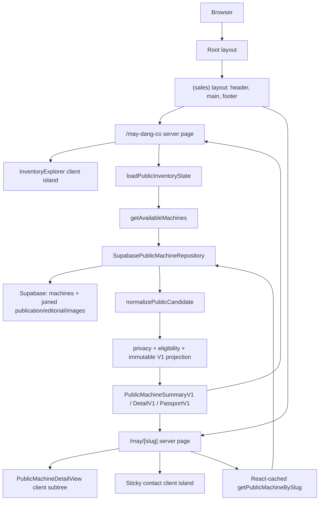
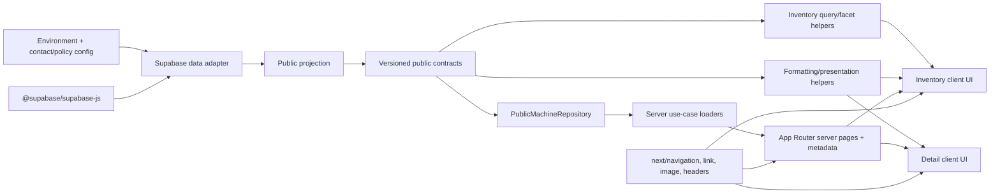

# Repository Architecture Audit

Audit date: 2026-07-22  
Repository: `muabanmacbookcu-web`  
Scope: architecture and current UX only; no redesign or implementation changes

## Executive Summary

The repository is a small Next.js 16 App Router application whose public product is currently an inventory list plus a machine dossier. It is not yet the public interface described by the MBMC Decision Architecture: `/` permanently redirects to the inventory, so there is no homepage experience, recommendation flow, story system, or care area. The strongest architectural asset is the server-only public-projection boundary. Raw Supabase records do not flow directly into React. They are selected through an explicit allowlist, normalized from untrusted rows, privacy- and publication-gated, assembled into frozen versioned DTOs, and only then rendered.

The live application has three user-facing route shapes: `/`, `/may-dang-co`, and `/may/[slug]`; `/may-dang-co/[slug]` is a compatibility redirect. Inventory data is loaded from Supabase with 60-second revalidation. Filtering, search, sorting, facet counts, URL synchronization, contact-channel persistence, gallery interaction, and the lightbox run in client components. Most content and all database access remain server-side.

The codebase is in a transitional state. The active `PublicMachineSummaryV1` / `PublicMachineDetailV1` stack coexists with an older `MachineDetail` / `MachinePassport` stack that no route imports. Several V1 contract fields are deliberately present but always empty or unknown: inspection, warranty, passport facts/timeline, source verification, repair status, decision specifications, technical specifications, and related machines. The UI therefore makes trust-oriented promises that the data layer cannot yet substantiate fully. In particular, inventory copy says machines are “kiểm định,” while projection currently emits `inspection.status = "not_available"` for every machine.

Verification at audit time:

- `npm.cmd run test:public`: 74/74 tests passed. Node emitted a module-type warning because `package.json` has no `"type": "module"` while the test imports TypeScript ES modules.
- `npm.cmd run lint`: completed with 3 `react-hooks/exhaustive-deps` warnings and no errors.
- `npm.cmd run build`: succeeded on Next.js 16.2.10. During prerendering the Supabase inventory query failed; the error was swallowed into the unavailable state and `/may-dang-co` was still emitted as a static ISR page. This is operationally significant because a transient build-time database failure can seed the cached public route with an unavailable response.

## Architecture

### Framework and runtime

| Area | Current implementation |
|---|---|
| Framework | Next.js 16.2.10, App Router, Turbopack production build |
| UI runtime | React 19.2.4 / React DOM 19.2.4 |
| Language | Strict TypeScript; a Node `.mjs` regression suite imports TS source directly |
| Styling | One global CSS file plus Tailwind CSS 4 imported via PostCSS; components use handwritten semantic class names rather than Tailwind utilities |
| Database | Supabase JS 2.110.6, queried server-side with the service-role key |
| Images | `next/image`; remote images allowed from the configured Supabase public-storage host and `img.mbmc.vn/machines/**` |
| Rendering | App Router server components by default, client islands where browser state or gestures are needed, ISR at 60 seconds for inventory/detail data |
| Tests | One 638-line Node test file containing 74 projection, filter, component-source, interaction, responsive-CSS, and ordering regression tests |

There is no application state library, component library, schema-validation package, analytics SDK, CMS SDK, middleware, API route, server action, or route handler.

### App and routing structure

`src/app/layout.tsx` is the root layout. It owns global metadata, `lang="vi"`, and `globals.css`, but no providers. The `(sales)` route group adds `SiteHeader`, `<main>`, and `SiteFooter` without changing the URL. Route-local `_components` directories keep inventory and machine-detail implementation files out of routing.

The root error and not-found states sit outside `(sales)`. As a result, the global 404 and root error boundary render their own `<main>` and do not receive the sales header/footer. Route-specific machine not-found and loading states do receive the sales layout.

### Public routes

| Route | Purpose | Rendering strategy | Data source |
|---|---|---|---|
| `/` | Current “homepage”; performs no content rendering | Static server component calling `permanentRedirect`, producing a permanent redirect to `/may-dang-co` | None |
| `/may-dang-co` | Public inventory, search, facets, sort, result cards, and trust statement | Server page with `revalidate = 60`; list is rendered from server data, then filtering is hydrated as a client island | Supabase `machines` plus publication/editorial/image relationships through the public repository and V1 projection |
| `/may-dang-co/[slug]` | Compatibility for an accidental/old nested inventory-detail URL | Dynamic server route; permanent redirect to `/may/[slug]` | Only the URL parameter |
| `/may/[slug]` | Public machine dossier/detail | Dynamic server-rendered route with `revalidate = 60`; metadata and page each call a React-cached loader; dossier becomes a large client subtree | Same Supabase repository/projection, resolved by filtering eligible projected rows for exact slug |
| framework 404 | Unknown public URL | Static root not-found UI | None |

There are no public routes for recommendation, decision stories, policies hosted in this app, selling, or care. Header links for policies, selling, and brand navigate to external `muabanmacbookcu.com` URLs. `#chon-macbook` is linked from the desktop header but no matching element exists on the current pages.

Build output classifies `/` and the framework 404 as static, `/may-dang-co` as static ISR, and both slug shapes as dynamic/on-demand.

### Layouts, providers, and server/client boundaries

There are no root-level React providers. The only React context is `PublicMachineMediaProvider`, scoped to a single detail page and responsible for the shared gallery/lightbox index.

Server-only modules explicitly import `server-only`:

- Supabase client creation.
- Public repository entry points.
- Projection kernel/eligibility/privacy/assembly path by import topology and `.server.ts` naming.

Client boundaries are:

- `SiteHeader`: reads contact-channel browser state.
- `InventoryExplorer`: owns query/facet/sort state and browser history.
- `InventoryFilters`: owns dropdown state, viewport mode, outside-click and Escape handling.
- `MachineCard`: preserves the selected contact channel in links.
- `PublicMachineDetailView`: preserves the contact channel in breadcrumbs and wraps the detail subtree.
- `DecisionPanel`, `PoliciesAndSupport`, `PublicMachineStickyBar`: resolve the active contact destination.
- `PublicMachineMediaProvider`, `PublicMachineGallery`, `DetailedImages`, and `SlidingImageTrack`: gallery, pointer gestures, lightbox, focus restoration, and image-shape state.
- Root `error.tsx`: retry interaction.

Because `PublicMachineDetailView` itself is marked client, all of its imported detail presentation descendants are delivered through a client boundary even when they are otherwise pure. Likewise, every inventory card hydrates solely to preserve a query-string contact channel. This is simple but broadens the client bundle and hydration surface.

### Architecture diagram



### Data flow and layer responsibilities

1. **Supabase selection.** `supabase-public-machine-repository.ts` selects an explicit column list from `machines` with `machine_publications!inner`, `machine_editorials`, and `machine_images`. The query filters publication status to `published` and orders by `machine_id`. It does not narrow `getBySlug` at the database; both list and detail load and project every published candidate.
2. **Untrusted-row adapter.** `project-public-candidates.ts` treats database output as `unknown`, checks record shapes, coerces strings/integers/arrays, deduplicates images by public URL, derives family from `model_text`, maps snake_case columns to projection input, and emits privacy-safe diagnostics.
3. **Normalization kernel.** `normalizePublicMachineFacts` copies mutable arrays/objects, filters images to allowlisted public visibility/type/stage values, trims URLs/alts, and sorts images deterministically.
4. **Privacy gate.** `validateProjectionPrivacy` checks a single `privacyValid` boolean. The current Supabase adapter always sets it to `true`; practical privacy enforcement is therefore mainly the explicit SQL allowlist and image filter, not an independently derived record-level check.
5. **Eligibility gate.** Publication audit fields, safe slug, matching approved/published editorial revisions, `new_in_stock` machine status, positive integer price, exactly one public cover, reviewed condition copy, core configuration, and editorial review metadata are required. Ineligible rows are excluded rather than partially rendered.
6. **DTO assembly.** Assemblers construct versioned summary, detail, and passport objects. Defaults explicitly represent missing subsystems (`unknown`, `not_available`, empty arrays/maps). The complete result is recursively frozen.
7. **Repository.** `list()` keeps eligible summaries and sorts newest-first with slug fallback. `getBySlug()` scans the fully projected result for an exact eligible slug. Database failures are logged with safe stage/code/operation fields and rethrown as `PublicInventoryDatabaseError`.
8. **Use-case loaders.** `getAvailableMachines` delegates to `list`. `getPublicMachineBySlug` wraps `getBySlug` in React `cache`, deduplicating metadata/page loads within a server render context.
9. **Page load state.** Inventory wraps all loader errors in `{status: "unavailable"}`; detail does not and therefore falls through to the route error boundary on repository failure. A genuine missing/ineligible slug becomes route-specific 404.
10. **Page/component presentation.** Server pages pass DTOs to the inventory/detail views. Presentation helpers localize currency, availability, dates, storage, and public names/spec strings. Inventory normalization then builds searchable/faceted client-side records without mutating the DTO.
11. **UI state.** Inventory search/facets/sort are written to browser history. Gallery and lightbox use local/context state. Contact attribution is read from `?channel=zalo|messenger`, persisted in `localStorage`, and propagated through internal links.

### Dependency diagram



### Public machine contract

Classification key:

- **Required:** structurally mandatory and eligibility guarantees a usable value.
- **Optional:** structurally mandatory but semantically nullable/empty, or a discriminated state expresses absence.
- **Legacy:** belongs to the older, inactive `MachineDetail` model family rather than the active V1 contract.
- **Unused:** present in the active contract but not currently read by production UI. “Unused” can coexist conceptually with required/optional; the table prioritizes runtime use status.

#### `PublicMachineSummaryV1`

| Field | Classification | Source / assumption | Current UI use |
|---|---|---|---|
| `schemaVersion` | Required | Constant `public-machine-summary.v1` | Unused |
| `code` | Required | `machines.machine_id`; must be nonblank | Card footer, passport, contact context |
| `slug` | Required | Published safe lowercase slug without embedded UUID | Route links and lookup |
| `displayName` | Required | `model_text`; processor tokens may be removed only for display | Titles, search, specs, metadata |
| `family` | Required | Derived by regex as Air/Pro/Unknown | Search/family facet; not directly displayed |
| `year` | Optional | Projection input supports it, but current Supabase adapter does not select/map a year | Detail technical rows if present; currently always `null` |
| `screenSizeInches` | Optional | Supported by projection, but not selected/mapped; inventory infers screen facet from display name instead | Detail technical rows if present; currently always `null` |
| `chip` | Required | `machines.chip`; eligibility requires nonblank | Cards, search/facets, detail specs |
| `ramGb` | Required in practice | Nullable type, but eligibility requires a positive safe integer | Cards, search/facets, detail specs |
| `ssdGb` | Required in practice | Nullable type, but eligibility requires a positive safe integer | Cards, search, detail specs |
| `color` | Required in practice | Nullable type, but eligibility requires nonblank | Card specs and detail breadcrumb/specs |
| `price` | Required | Positive safe integer `retail_price_expected`, currency fixed to VND | Cards, hero, sticky bar, sorting/facets |
| `availability` | Required | Hard-coded to `available` because only `new_in_stock` is eligible | Cards, hero, passport |
| `coverImage` | Required | Exactly one eligible public cover is required | Card and OG image |
| `imageCount` | Required | Filtered public gallery length | Unused |
| `batteryHealthPercent` | Optional | `battery_health` safe integer or null; no range validation | Card/detail facts |
| `cycleCount` | Optional | `battery_cycle` safe integer or null; no nonnegative/range validation | Card/detail facts |
| `cosmeticGrade` | Optional | Raw `rank` string; unconstrained public grade | Card/detail facts |
| `conditionSummary` | Required | Reviewed editorial public condition copy | Metadata fallback and detail facts |
| `warranty` | Optional / Unused | Assembler always emits `unknown` | No active component reads it |
| `inspection` | Optional | Assembler always emits `not_available` | Only controls whether one trust-anchor bullet is hidden |
| `contextualLabel` | Optional | Editorial string | Status label on cards/detail hero |
| `publishedAt` | Required in practice | Nullable contract, but eligibility requires it | Repository/newest sorting |
| `updatedAt` | Optional / Unused | Publication timestamp | No active component reads it |

#### Nested summary types

| Type / field | Classification | Notes |
|---|---|---|
| `PublicMoney.amount` | Required | Positive safe integer by eligibility |
| `PublicMoney.currency` | Required | Always `VND` |
| `PublicImage.url` | Required | Nonblank public URL after visibility/type/stage allowlisting |
| `PublicImage.alt` | Required | Explicit alt when supplied; otherwise generated from display name and ordinal |
| `PublicImage.width`, `height` | Optional / Unused | Current adapter does not select/map dimensions, so both are always `null`; `next/image` uses fill layouts |
| `PublicWarranty.status` | Required state | `unknown`, `not_applicable`, `active`, or `expired`; currently always `unknown` |
| `PublicWarranty.durationMonths`, `activatedAt`, `expiresAt` | Optional / Unused | Null unless active/expired; no current producer or consumer |
| `PublicInspection.status` | Required state | Supports unavailable/passed/failed/incomplete; currently always unavailable |
| `PublicInspection.inspectedAt`, `summary` | Optional / Unused | Always null under current assembler |

#### `PublicMachineDetailV1`

| Field | Classification | Source / assumption | Current UI use |
|---|---|---|---|
| `schemaVersion` | Required | Constant `public-machine-detail.v1` | Unused |
| `summary` | Required | Reassembled from the same kernel | Primary identity and facts |
| `gallery` | Required | All eligible public images, sorted; eligibility guarantees at least the cover | Hero, thumbnails, evidence grid, lightbox |
| `expertSummary` | Optional | Editorial judgement | Recommendation and metadata description |
| `suitableFor` | Optional | Editorial string array | Recommendation |
| `notSuitableFor` | Optional | Editorial string array | Recommendation |
| `decisionSpecifications` | Optional / Unused | Assembler always emits `[]` | No active component reads it |
| `technicalSpecifications` | Optional | Assembler always emits `{}`; renderer allowlists six keys | Detail spec builder reads it, but currently gets no rows from it |
| `includedItems` | Required container | Editorial object or all-unknown fallback | Detail facts |
| `policyApplicability` | Optional / Unused | Editorial string array | UI ignores it and instead renders global `publicSalesPolicies` |
| `passport` | Required | V1 passport assembled from kernel | Passport dossier |
| `relatedMachines` | Optional / Unused | Always `[]` | No active component reads it |

`PublicIncludedItems.charger`, `cable`, `box`, and `bag` are nullable booleans; `null` means unknown, `false` means known absent, and `true` means included. `accessories` is a required array that may be empty. The UI lists only true flags and accessory strings; if any core flag is known but none is true, it says “Không kèm phụ kiện.”

`PublicFact` requires `label` and `value`. `PublicTimelineEvent` requires `type`, `title`, and `occurredAt`. Neither is currently produced with entries.

#### `PublicMachinePassportV1`

| Field | Classification | Source / assumption | Current UI use |
|---|---|---|---|
| `schemaVersion` | Required | Constant `public-machine-passport.v1` | Unused |
| `code` | Required | Kernel code | Passport heading |
| `slug` | Required / Unused | Kernel slug | No active component reads it |
| `publicStatus` | Required | Hard-coded available through kernel | Passport summary |
| `facts` | Optional | Always empty | Renderer supports rows |
| `timeline` | Optional | Always empty | Renderer supports chronological events |
| `inspection` | Optional / Unused | Always unavailable | Passport component does not render it |
| `sourceVerification` | Optional / Unused | Always `unknown` | Not rendered |
| `repairStatus` | Optional / Unused | Always `unknown` | Not rendered |
| `firstPublishedAt` | Optional | Publication timestamp if selected | Passport summary |
| `lastPublishedAt` | Required in practice / Unused | Published timestamp | Not rendered |

#### Legacy contracts

`src/models/machine.ts`, `passport.ts`, `inventory.ts`, and `contact.ts` define a separate, older object graph: `MachinePreview`, `MachineDetail`, `DecisionSpecifications`, grouped `TechnicalSpecifications`, `ConditionNote`, `InspectionItem`, `MachinePassport`, `InventoryQuery`, and `InventoryResult`. No active route or active repository produces this graph. The corresponding `MachineDetailView`, generic passport components, contact components, and `MachineStickyActionBar` are inactive. `MachineAvailability`, `Money`, and related presentation helpers are still indirectly reused because the active public types are structurally compatible, but the two contract families remain conceptually divergent.

## Current UX

### Component tree and coupling

```text
RootLayout
└── SalesLayout
    ├── SiteHeader [client: contact attribution]
    ├── route
    │   ├── InventoryPage [server]
    │   │   └── InventoryPageView
    │   │       ├── InventoryIntro
    │   │       ├── InventoryExplorer [client: search/facets/sort/history]
    │   │       │   ├── InventoryFilters [client: dropdown/mobile behavior]
    │   │       │   ├── InventoryToolbar
    │   │       │   └── MachineCatalog
    │   │       │       └── MachineCard [client: attributed link]
    │   │       ├── empty/unavailable state
    │   │       └── InventoryTrustStatement
    │   └── PublicMachinePage [server]
    │       ├── PublicMachineDetailView [client boundary]
    │       │   └── PublicMachineMediaProvider [client context]
    │       │       ├── breadcrumb
    │       │       ├── PublicMachineGallery → SlidingImageTrack
    │       │       ├── DecisionPanel
    │       │       ├── DecisionDossier
    │       │       │   ├── PassportDossier
    │       │       │   ├── MachineEvidenceGrid
    │       │       │   └── MbmcRecommendation
    │       │       ├── DetailedImages
    │       │       ├── PublicSpecifications
    │       │       ├── PoliciesAndSupport
    │       │       └── lightbox → SlidingImageTrack
    │       └── PublicMachineStickyBar [client]
    └── SiteFooter
```

Major responsibilities and coupling:

| Component/module | Props / state | Reuse and coupling assessment |
|---|---|---|
| `SiteHeader` | No props; contact hook state | Shared layout component, but inventory is always marked current, internal fragment link is unresolved, and contact attribution makes the entire header client-rendered |
| `InventoryPageView` | `machines` summary array | Thin composition boundary and a good reusable page-view seam |
| `InventoryExplorer` | `machines`; owns canonical URL state | Central orchestration component; tightly coupled to `window.history`, query helper functions, contact attribution, and all inventory controls |
| `InventoryFilters` | facets, sort, counts, callbacks | Largest UI component (265 lines). Good controlled-prop API, but it combines option content, responsive mode detection, popup behavior, active chips, and desktop/mobile sort |
| `MachineCard` | one summary DTO | Directly coupled to public DTO and routing/contact attribution. Presentation extraction is partial (`machine-card-presentation.ts`) |
| `PublicMachineDetailView` | one detail DTO | Clear page composition, but unnecessary top-level client boundary couples all descendants to hydration |
| `PublicMachineMediaProvider` | images, title, children | Useful shared state between hero, evidence images, and lightbox; contains focus/keyboard/scroll-lock behavior with hook dependency warnings |
| `SlidingImageTrack` | images, selected index, callbacks, sizes, variant | Reused correctly by hero and lightbox; gesture mechanics and rendering remain tightly combined |
| `DecisionPanel` | detail DTO | Identity, formatting, trust, contact behavior, and CTA are combined; `configuration(machine)` is exported for tests/use |
| `DecisionDossier` | detail DTO | Small ordering/composition seam, well suited to future dossier section reordering |
| `PassportDossier` | detail DTO | Couples passport presentation back to `machine.summary` for model name rather than accepting a self-sufficient passport view model |
| `MachineEvidenceGrid` | detail DTO | Uses a dedicated Evidence presentation builder; one of the cleaner DTO/presentation boundaries |
| `PublicSpecifications` | detail DTO | Uses a trusted allowlist builder, protecting the UI from arbitrary technical keys |
| `PoliciesAndSupport` / sticky bar | detail DTO + contact hook | Policy applicability from the machine is ignored; repeated naming/spec/contact formatting exists across three CTA surfaces |

### Design system audit

The application has a coherent visual foundation but no formal token/component system. `globals.css` contains all 336 lines of styling.

| Area | Current state | Consistency |
|---|---|---|
| Typography | System sans stack; clamp-based large headings; tight negative heading tracking; muted body text; uppercase green eyebrows | Generally consistent. No explicit type scale or reusable text primitives; font weights include unusual numeric values such as 570/620/760 that depend on system-font interpolation |
| Color | Nine root variables for background/surface/text/borders/accent; additional hard-coded grays/greens throughout | Calm and consistent in appearance, but token use is incomplete and contrast is not documented/tested |
| Spacing | Mostly `.25rem`–`4rem` values, 72rem container, mobile page padding, large section gaps | Visually patterned but no spacing tokens; similar components use ad hoc values |
| Grid | Inventory 1/2/3/4 columns at mobile/40rem/56rem/100rem; detail hero splits at 56rem; dossier/facts/spec grids adapt at 40rem | Clear mobile-first behavior and sensible minmax usage |
| Cards | White surface, subtle border, small radius; inventory hover lifts 2px; dossier cards use stronger borders | Consistent quiet card language; inventory and dossier radii/padding vary without a named variant system |
| Buttons/links | Primary dark filled action, secondary outlined action, pill facet triggers/chips, text navigation | Functional hierarchy is clear. Styles are class-specific rather than reusable primitives; hover feedback is stronger on some controls than others |
| Badges/status | Green text/dots, contextual text labels, trust-anchor bullets | Restrained and non-promotional. Status relies partly on color but also includes text |
| Forms | Search input, native desktop sort select, button-based facet fieldsets | Good focus-within and labels. No validation or form submission because filtering is local |
| Navigation | Mobile has brand plus “Tìm” and contact; desktop has five destinations | Responsive, but route awareness is hard-coded, one anchor is dead, and external navigation is not visually distinguished |
| Icons | Unicode glyphs (`⌕`, `⌄`, `✓`, arrows, fullscreen, ×) and no icon dependency | Lightweight, but cross-platform rendering/alignment may vary; fullscreen/search glyph semantics rely on labels |
| Empty/error states | Separate no-match, no-published, unavailable, 404, detail-404, and retry error states | State coverage is good. One empty-state heading is unexpectedly English; unavailable/loading states are visually minimal |
| Loading/skeletons | Route loading files show a single status paragraph | Accessible status text exists, but there are no skeletons or layout-preserving placeholders |
| Motion | 180ms card/facet transitions, 400ms carousel easing, hover zoom, smooth scroll | Restrained; reduced-motion disables smooth scroll, card/image transitions, and shortens carousel transition. No autoplay |
| Hover | Card lift, image zoom, facet menu row background, border changes | Desktop discoverability is reasonable; core information never depends on hover |
| Focus | Global 3px green `:focus-visible`; lightbox attempts focus trap and restores opener | Strong baseline. Gallery section itself is focusable for arrow keys, while inner buttons are also keyboard accessible |
| Responsive behavior | Mobile horizontal cards; tablet vertical cards; mobile filter grid; desktop pills/select; edge-to-edge mobile gallery; sticky CTA adapts and hides only price | Extensive and regression-tested. `useMobileInventoryMode` duplicates the CSS breakpoint in JavaScript, so behavior can drift from styles |

Accessibility strengths include Vietnamese document language, semantic sections/headings/lists/dl, named nav landmarks, labeled gallery buttons, `aria-live` image counts, focus return after lightbox close, Escape support, reduced motion, and text alongside colored status. Gaps include no skip link, no automated accessibility tooling, generic generated image alts, a manually implemented modal focus trap rather than native dialog behavior, and no explicit announcement of filtered result changes beyond normal rerendering.

### Homepage analysis

There is no homepage information architecture to evaluate: `/` immediately issues a permanent redirect to `/may-dang-co`.

- **Current hierarchy:** inventory title → descriptive sentence/live count → search and filters → result count/cards → machine-record trust statement → footer.
- **Current CTA hierarchy:** machine-card links are the primary path; header contact and mobile contact are persistent secondary paths; search/filter controls precede cards. There is no “start from needs” path.
- **Current cognitive flow:** arrival → browse/filter stock → inspect a specific machine → contact MBMC. The user is assumed to know enough about MacBook categories/specifications to filter inventory.
- **Strengths:** immediate access to real stock, little promotional noise, no urgency mechanics, visible prices and condition facts, direct route to evidence.
- **Weaknesses:** confusion is not acknowledged or oriented; the site starts with machines rather than the person; no trade-off framing, recommendation entry, decision stories, or staged trust explanation exists. Because `/` is a permanent redirect, search engines and shared links also have no distinct home document.

### Inventory page analysis

**Filtering and sorting.** Search covers display name, public code, family, chip, RAM, raw/compact SSD, and color. Price is single-select; family/chip/RAM/screen are desktop multi-select but mobile single-select. Groups combine with AND and options within a group with OR. Facet counts preserve other groups while replacing the simulated current group. URL parameters (`q`, `sort`, `price`, `family`, `chip`, `ram`, `screen`) are validated and round-trip through browser history. Back/forward state is supported.

Screen size is inferred from `displayName`, not `screenSizeInches`, because the current adapter does not populate the contract field. “Relevance” has no score: it falls back to slug order. Search input updates `history.replaceState` on every keystroke without debounce, but filtering is entirely in memory and suitable for a small inventory.

**Cards and density.** Cards expose actual image, availability/context, normalized name, configuration/color, price, condition, battery fallback, cosmetic grade, public code, and a detail CTA. Mobile cards intentionally remove status, fact grid, and code, preserving title/spec/price/compact condition/CTA. Desktop cards become denser. The balance is calm, although the same cosmetic information may appear both in the compact condition sentence and the fact grid at wider sizes.

**Performance.** Supabase loads every published candidate and all selected related images for both list and detail. Summary projection constructs full galleries before discarding all but cover/image count, increasing query payload and server work. All eligible summaries are serialized to the client, then normalized and filtered locally. This avoids round trips during interaction and is excellent for a small catalog but does not paginate or virtualize. Each card hydrates and runs the contact hook. Facet counts repeatedly filter the normalized array for every option; again acceptable at current scale, nonlinear enough to revisit for a large catalog.

**Journey and failure behavior.** The journey is straightforward: understand stock count, narrow results, open a full-card link, evaluate dossier. Empty-filter and no-published states are distinct. A database/configuration failure becomes a restrained status message rather than a crash, but the broad catch hides the cause and build-time failures can become cached ISR output.

### Machine detail analysis

Current section order:

1. Breadcrumb.
2. Hero gallery and sticky decision panel: availability/context, name, configuration, price, trust anchors, contact CTA.
3. Two-card decision dossier: Passport first, real-condition facts second.
4. MBMC recommendation across the dossier width when editorial content exists.
5. Additional observation images (all gallery images after index 0).
6. Technical specifications.
7. Handover/support policies and contact card.
8. Fixed sticky identity/price/contact CTA outside the page view.

The decision flow is therefore identity/price → trust labels → record/evidence → judgement/fit → more images → specs → process/contact. This is closer to a dossier than a conventional commerce detail page and has useful progressive disclosure. Actual gallery images, reviewed public condition copy, public code, publication date, suitable/not-suitable statements, and known battery/cycle/accessory facts are the strongest trust elements.

Weak points:

- Passport currently contains little beyond code, public status, model, and optionally first publication date; facts and timeline are always empty.
- Trust anchor “Thông tin đã duyệt” is supported by publication/editorial gates, but “MBMC Passport” may imply more evidence than the current sparse object holds.
- Inventory says machines were inspected, while detail deliberately hides inspection because it is always unavailable.
- `sourceVerification`, `repairStatus`, known/unknown distinctions, warranty, policy applicability, and last publication date are not rendered.
- Recommendation appears after condition in the current dossier order, not before the evidence as envisioned by the target IA.
- The page repeats contact CTAs in hero, support, and fixed sticky bar. This is consistent but shifts cognitive emphasis toward contact before the dossier is fully read.
- There is no alternatives/related-machine path in the active detail UI even though `relatedMachines` exists in the contract.

## Current Strengths

- Strong server-side public-data boundary with explicit selection, image allowlisting, eligibility checks, safe diagnostics, versioned DTOs, and deep freezing.
- Publication workflow is encoded technically: approved/published editorial revisions must match and review/audit actors/timestamps must exist.
- Invalid or private candidates are excluded independently; one malformed row cannot hide valid machines.
- Clear separation among raw database normalization, eligibility, assembly, repository, page loading, presentation formatting, and UI state.
- Good deterministic regression coverage for privacy, projection exactness, filtering, URL state, accessibility interactions, carousel mechanics, responsive behavior, and page section order.
- Mobile-first layout, restrained motion, reduced-motion support, explicit focus treatment, and no urgency/dark-pattern behavior.
- Inventory and detail share one canonical DTO and common presentation helpers, avoiding raw database knowledge in components.
- Route-level unavailable, empty, not-found, loading, and retry paths exist.
- `next/image`, explicit responsive `sizes`, first-gallery-image priority, and remote-image allowlisting provide a sound media baseline.

## Current Weaknesses

- No actual homepage; the current public experience starts at the catalog and assumes pre-existing product literacy.
- Many trust-oriented contract capabilities are placeholders, creating a gap between language and evidence.
- Detail lookup performs an unfiltered full published-inventory fetch and projection.
- Client boundaries are broader than required for contact attribution and detail presentation.
- Design rules live in one global stylesheet without named primitives/tokens beyond basic colors.
- Header navigation is partially external, has a dead fragment link, and always marks inventory current.
- SEO coverage is limited to basic metadata and detail OG/canonical fields.
- Old and new machine models/components coexist, obscuring the authoritative architecture.
- Current inventory filtering semantics differ by viewport: multi-select on desktop becomes single-select on mobile without being visible in the data model.
- Error handling deliberately collapses all inventory failures, limiting observability at the UI and risking cached unavailable output.

## Risks

### SEO, metadata, and discoverability

| Area | Current state | Risk |
|---|---|---|
| Base metadata | Root title template and description; Vietnamese language | Low |
| Inventory metadata | Static title and description | Low; no canonical or OG override |
| Detail metadata | Dynamic title/description, canonical, OG title/description/type/url/image | Moderate: canonical origin is inferred from request headers, making it proxy/config dependent; helper is called twice |
| Homepage | Permanent redirect to inventory | High for future homepage identity; no distinct index content |
| Canonical | Detail only | Moderate; inventory/root have no explicit canonical and no `metadataBase` |
| Structured data | None | High missed opportunity for product/inventory/breadcrumb evidence; no current schema contract |
| Robots/sitemap | No `robots.ts`, `sitemap.ts`, or static equivalents found | Moderate; framework defaults allow crawling, but discovery/control are implicit |
| Open Graph/Twitter | Detail OG only; no site-wide OG defaults or Twitter cards | Moderate |
| Dynamic discovery | No `generateStaticParams`; detail is on-demand | Low at small scale; sitemap absence compounds discoverability |

### Performance and operations

- Service-role Supabase access is correctly server-only, but a privileged key magnifies the consequence of any future server/client boundary leak.
- `NEXT_PUBLIC_SUPABASE_ANON_KEY` is documented but unused.
- `getBySlug` fetches/project all published machines and all their images; cost grows with catalog size.
- Detail metadata and page rely on React `cache`, but cross-request/data-cache behavior is governed only by route revalidation and the Supabase call has no explicit fetch cache configuration visible at this layer.
- A caught build-time inventory error can prerender unavailable content; build still passes, so deployment checks do not reveal a broken data dependency unless logs are monitored.
- The global detail client subtree, multiple contact hooks, all-card hydration, full-track image rendering, and loading every gallery image element increase JS/DOM/media pressure.
- Image dimension fields are absent, limiting intrinsic metadata and potentially making source quality harder to reason about, although fill/aspect-ratio containers reduce layout shift.
- No analytics, performance budgets, instrumentation, or web-vitals reporting were found.

### Accessibility risks

- No skip-to-content link.
- No axe/Playwright/browser-based accessibility suite; tests largely inspect source strings and pure behavior.
- Manual lightbox focus trapping covers buttons only and depends on effect closures that lint flags.
- The English no-match heading is inconsistent with `lang="vi"` and surrounding copy.
- The unavailable/loading screens do not preserve the page’s expected layout and provide minimal recovery guidance.
- Hard-coded colors have no recorded contrast verification.

## Technical Debt

### Dead or inactive code

- Entire legacy `MachineDetail` route-view family: `MachineDetailView`, `MachineSummary`, `MachineAvailability`, `MachinePrice`, `MachineGallery`, `DecisionSpecificationsView`, `MachineExpertSummary`, `MachineCondition`, `TechnicalSpecificationsView`, `IncludedItems`, `SalesProcess`, `CompareAlternatives`.
- Generic passport component family under `src/components/passport`.
- `ContactCTA`, `ContactChannelList`, and `MachineStickyActionBar`.
- Legacy repository interface `MachineRepository` and legacy `InventoryQuery` / `InventoryResult` model path.
- `imageTypeLabel`, `galleryIndexAfterSwipe`, and `selectionKeepsFilterOpen` are not used by production code; some remain exercised by regression tests.
- `PublicInventoryFilter`, `PublicInventorySort`, and `filterAndSortPublicInventory` are retained only for original API/tests.
- CSS for `.machine-sticky-action`, `.machine-gallery`, `.section`, `.specification-grid`, `.contact-channels`, and related legacy surfaces remains alongside active styles.

### Duplicate or inconsistent logic

- Two machine contract families use similar names with different shapes and null semantics.
- Contact configuration is split: `contact.ts` has a mailto default and Zalo constant, while `useContactChannel.ts` hard-codes Zalo and Messenger again. `ContactChannel` is also defined separately in the hook and models.
- Display name, specification, and contact-label preparation repeats in the hero panel, support section, sticky bar, and card.
- Detail assembler creates the summary more than once (projection returns summary, detail assembly creates another, passport is also assembled separately).
- `year`/screen-size contract fields and the inventory’s display-name regex represent competing sources for the same facet.
- Global policy content is rendered even though the detail DTO carries per-machine `policyApplicability` that is ignored.

### Large components and files

- `InventoryFilters.tsx` (265 lines) combines responsive detection, content configuration, popup interaction, controlled selection, sort, and active chips.
- `public-inventory-query.ts` (242 lines) combines normalization, search, facet classification/counting, sorting, URL parsing/serialization, and a legacy compatibility API.
- `kernel.server.ts` (222 lines) is reasonably cohesive but owns both public image policy and normalization.
- `globals.css` (336 lines) is the entire design implementation and mixes active and legacy systems.
- `public-inventory.test.mjs` (638 lines) is broad and valuable but couples many tests to source-text/CSS-string structure rather than rendered behavior.
- `project-public-candidates.ts` is only 129 physical lines but is highly compressed, reducing auditability and increasing change risk.

### Missing abstractions or safeguards

- No runtime schema validator for Supabase rows or public DTO output; normalization is hand-written.
- No generated Supabase database types.
- No explicit database query specialized for summary versus slug detail.
- No central route/origin/site metadata configuration.
- No formal design tokens for spacing/type/radius/motion or shared button/card primitives.
- No error taxonomy in `loadPublicInventoryState`; configuration, network, permission, and query errors are indistinguishable to callers.
- Battery/cycle values are integer-checked but not domain-range checked.
- Privacy validation is architecturally present but currently receives an unconditional `true` from the database adapter.

### Naming inconsistencies

- Active storage field is `ssdGb`; presentation functions alternate between `ssdGb` and `storageGb`; legacy models use `storageGb`.
- Route uses `/may`, inventory uses `/may-dang-co`, and compatibility nests the slug under `/may-dang-co`.
- Public code originates from a column named `machine_id`, while a separate projection input `id` exists but is unused.
- “Passport,” “hồ sơ máy,” “Decision Dossier,” and “public detail” overlap as labels for related but different layers.
- Availability type supports reserved/sold/unavailable, but current eligibility and assembly permit only available.

### Known lint/build debt

- Missing hook dependencies in `InventoryFilters`, `PublicMachineMediaProvider`, and `SlidingImageTrack`.
- Node test module-type warning due to ESM/TypeScript import behavior.
- Production build can succeed despite a failed data fetch and cached unavailable output.

## Future Compatibility

The following estimates evaluate architecture fit only. They are not implementation proposals.

| Capability | Difficulty | Risk | Current enablers | Primary gaps |
|---|---|---|---|---|
| Recommendation | High | High | `suitableFor`, `notSuitableFor`, public inventory DTO, pure filtering helpers | No needs/profile model, recommendation logic, explanation contract, route, persistence, or uncertainty/trade-off schema |
| Decision Stories | Medium | Medium | App Router composition, editorial content precedent, quiet card language | No story data source/contract/routes/components; evidence and privacy workflow would need definition |
| Trust System | High | High | Strong projection/privacy/eligibility architecture; images, condition, public code, passport shell | Most trust fields are defaults/empty; privacy flag is unconditional; no known/unknown, repair, warranty, inspection, policy-result, or source-evidence producers |
| Homepage IA | Medium | Medium | Sales layout, inventory summaries, reusable machine cards, target content spec | `/` is a permanent redirect; header assumes inventory; no homepage component/content/data composition or recommendation/story/trust inputs |
| Passport improvements | Medium | Medium–High | Versioned passport contract and existing dossier/timeline renderer | Facts/timeline/verification/repair/inspection are empty or ignored; contract semantics and source mapping must be established before UI expansion |
| Timeline improvements | Medium | High | Timeline type and chronological renderer already exist | No events are assembled; public event taxonomy, privacy rules, provenance, and lifecycle data are undefined |
| Known / Unknown sections | Medium | High | Nullable fields and explicit unknown/not-available states provide a base | UI currently often omits unknowns, contract lacks a first-class known/unknown/evidence-reason model, and language needs factual guarantees |
| Inventory evolution | Medium | Medium | Mature local query helpers and tested URL state | No pagination/server search, relevance score, stable screen field, or large-catalog performance strategy |
| Dossier section reordering | Low | Low | Small `DecisionDossier` and page-composition components | Some pure sections sit under an unnecessarily broad client boundary; data gaps are more important than order |

The most future-compatible part is the projection boundary: new public capabilities can be added safely only after their source facts, eligibility, privacy, and versioning semantics are settled. The greatest risk is treating currently empty V1 fields as if they were an implementation backlog rather than unresolved public claims. For MBMC’s “evidence before claims” principle, data provenance and unknown semantics must precede expanded presentation.

## Recommendations (analysis only)

These are preparatory conclusions for a later implementation prompt, not redesign instructions:

1. Treat `PublicMachine*V1` and the public-projection pipeline as the authoritative current architecture. Before future work, explicitly decide whether the legacy `MachineDetail` family is historical reference or a supported second contract.
2. Resolve truthfulness gaps before increasing trust language. Specifically reconcile “đã được kiểm định” with universally unavailable inspection data, and define what “Passport” guarantees today.
3. Define public evidence semantics for inspection, repair history, warranty, source verification, timeline, and known/unknown before populating UI sections. Each should identify source, absence meaning, privacy policy, eligibility impact, and whether it is fact or judgement.
4. Preserve the explicit Supabase selection and projection allowlist. Any future data source should still terminate at a versioned public contract rather than flow directly to components.
5. Establish route/origin/metadata ownership before a homepage is introduced; the permanent root redirect, inferred canonical host, absent sitemap/robots, and external header destinations are currently separate decisions.
6. Evaluate server/client boundaries before expanding page composition. The current client subtrees are acceptable at this size but will multiply hydration cost as homepage and dossier content grows.
7. Use the existing pure presentation/query builders and small composition seams as reuse points. Avoid treating the global CSS class set or legacy components as a settled design system.
8. Add operational checks around build-time inventory availability in any future delivery process; a green build does not currently mean public data rendered successfully.

## Files Inspected

### Repository and framework configuration

- `AGENTS.md`
- `package.json`, `package-lock.json`
- `next.config.ts`, `next-env.d.ts`
- `tsconfig.json`, `eslint.config.mjs`, `postcss.config.mjs`
- `.env.example` (variable names only; secret values were not included in the report)
- `.gitignore`, `README.md`, `CLAUDE.md`
- Production build route output and lint/test output

### Product context

- `brand/mbmc-macbook-why-we-exist.md`
- All six files under `product/`: decision psychology, design principles, information architecture, conversation principles, trust system, and homepage UX specification

### Application

- Every `.ts` and `.tsx` file under `src/app`, `src/components`, `src/config`, `src/data`, `src/hooks`, `src/lib`, and `src/models`
- `src/app/globals.css`
- `src/data/machines/public-inventory.test.mjs`
- Public asset inventory under `public/` and the application favicon (file presence/type; binary image content was not required for architectural analysis)

The repository-wide `rg --files` inventory and targeted reference searches were used to verify route coverage, client directives, metadata/SEO files, and inactive components. `node_modules` and `.next` generated source were excluded from file-by-file application inspection; build output was inspected instead.

## Suggested Reading Order for Future Contributors

1. `brand/mbmc-macbook-why-we-exist.md`
2. `product/mbmc-decision-psychology.md`
3. `product/mbmc-design-principles.md`
4. `product/mbmc-information-architecture.md`
5. `product/mbmc-trust-system.md`
6. `product/mbmc-homepage-ux-spec.md`
7. `src/lib/public-projection/contracts.ts` — the active public contract
8. `src/lib/public-projection/kernel.server.ts` and `eligibility.server.ts` — normalization and publication guarantees
9. `src/data/machines/project-public-candidates.ts` and `repositories/supabase-public-machine-repository.ts` — database-to-contract adapter
10. `src/app/(sales)/may-dang-co/page.tsx`, then its `_components` and `public-inventory-query.ts`
11. `src/app/(sales)/may/[slug]/page.tsx`, `PublicMachineDetailView.tsx`, and its active dossier/media components
12. `src/app/globals.css` — current responsive/design behavior
13. `src/data/machines/public-inventory.test.mjs` — encoded behavior and regression constraints
14. Legacy `src/models/machine.ts`, `passport.ts`, and inactive component families only after the active path is understood
